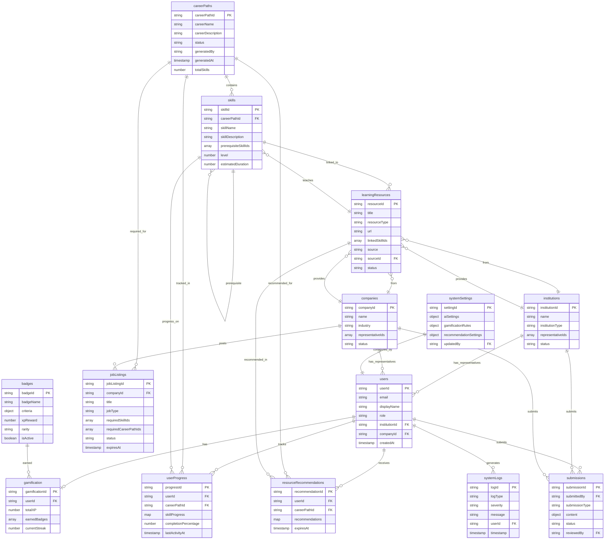

# PathAI - Firebase Firestore Schema Design

**Version:** 1.0  
**Date:** 12.22.2025  
**Based on:** SRS Version 3.2.IV
**Prepared by:** Ibrahim Alselawi  


---

## Table of Contents
1. [Schema Overview](#schema-overview)
2. [Visual ER Diagram](#visual-er-diagram)
3. [Collections](#collections)
4. [Data Models](#data-models)
5. [Relationships](#relationships)
6. [Indexes](#indexes)
7. [Security Rules Considerations](#security-rules-considerations)

---

## Schema Overview

This schema supports:
- Multi-role user management (User, Institution Rep, Company User, Admin)
- AI-generated career paths and skill trees
- User progress tracking
- Learning resource recommendations
- Gamification (XP, badges, milestones)
- Institution and company management
- Job listings and advertisements
- System logging and analytics

---

## Visual ER Diagram

The following Entity-Relationship diagram illustrates the relationships between all collections in the PathAI Firestore database:



### Diagram Legend

**Cardinality Symbols:**
- `||--o{` : One-to-Many (One entity can have many related entities)
- `||--o|` : One-to-One (One entity has exactly one related entity)
- `}o--||` : Many-to-One (Many entities relate to one entity)
- `||--o{` with self-reference : Self-referential relationship (e.g., skills prerequisites)

**Key Relationships Explained:**

1. **Users ↔ Career Paths**: Many-to-Many via `userProgress` collection
2. **Career Paths → Skills**: One-to-Many (one career path contains many skills)
3. **Skills → Skills**: Self-referential (prerequisites/dependencies)
4. **Skills ↔ Resources**: Many-to-Many (skills can have multiple resources, resources can teach multiple skills)
5. **Users ↔ Institutions/Companies**: Many-to-One (users can be representatives)
6. **Companies → Job Listings**: One-to-Many
7. **Users → Gamification**: One-to-One (each user has one gamification record)
8. **Badges → Gamification**: One-to-Many (users can earn multiple badges)

**Note:** In Firestore, relationships are typically implemented using:
- **Foreign Keys**: String references to document IDs (e.g., `userId`, `careerPathId`)
- **Arrays**: For many-to-many relationships (e.g., `linkedSkillIds[]`, `representativeIds[]`)
- **Maps/Objects**: For nested relationships (e.g., `skillProgress` map in `userProgress`)

### Simplified Core Relationships Diagram

For a high-level overview of the main data flow:


**Color Legend:**
- 🔵 Blue: User-related entities
- 🟡 Yellow: Career path entities
- 🟢 Green: Skills
- 🟣 Purple: Learning resources
- 🔴 Pink: Institution/Company entities
- 🟨 Light Yellow: Gamification

---

## Collections

### 1. `users`
**Purpose:** User profiles and authentication metadata

**Document ID:** `{userId}` (Firebase Auth UID)

```typescript
{
  // Basic Info
  email: string,
  displayName: string,
  photoURL: string | null,
  
  // Role Management
  role: "user" | "institution_rep" | "company_user" | "admin",
  roleAssignedAt: Timestamp,
  roleAssignedBy: string | null, // Admin UID who assigned role || registration 
  
  // Profile
  bio: string | null,
  skillLevel: "beginner" | "intermediate" | "advanced" | null,
  preferences: {
    learningStyle: "video" | "text" | "hands-on" | null,
    preferredDuration: number | null, // in hours
    institutionPreference: string | null, // institutionId
  },
  
  // Linked Entities
  institutionId: string | null, // If user is institution_rep
  companyId: string | null, // If user is company_user
  
  // Metadata
  createdAt: Timestamp,
  updatedAt: Timestamp,
  lastLoginAt: Timestamp,
  isActive: boolean,
}
```

**Indexes:**
- `role` (ascending)
- `institutionId` (ascending)
- `companyId` (ascending)
- `createdAt` (descending)

---

### 2. `careerPaths`
**Purpose:** Published career paths with skill trees (generated by AI or admin)

**Document ID:** Auto-generated

```typescript
{
  // Basic Info
  careerName: string, // e.g., "Software Engineer"
  careerDescription: string,
  careerCategory: string, // e.g., "Technology", "Healthcare" ?? might be catigory Arr[Atomic Cat]
  
  // Status
  status: "draft" | "published" | "archived",
  publishedAt: Timestamp | null,
  publishedBy: string, // Admin UID
  
  // AI Generation Metadata
  generatedBy: "openai" | "gemini" | "llama" | "admin" | "our AI",
  generatedAt: Timestamp,
  generatedByUserId: string, // Admin UID who triggered generation
  aiPrompt: string | null, // Original prompt used
  aiModel: string | null, // Model version used
  
  // Skill Tree Structure
  skillTree: {
    rootSkills: string[], // Array of skill IDs (root nodes)
    categories: {
      [categoryId: string]: {
        name: string,
        description: string,
        skillIds: string[], // Skills in this category
        order: number,
      }
    }
  },
  
  // Statistics
  totalSkills: number,
  estimatedDuration: number, // Total hours
  difficulty: "beginner" | "intermediate" | "advanced",
  
  // Related Data
  relatedCareerPaths: string[], // Array of careerPathIds
  onetCode: string | null, // O*NET occupation code
  
  // Metadata
  createdAt: Timestamp,
  updatedAt: Timestamp,
  version: number, // Increment on updates using firebase inc
  isActive: boolean,
}
```

**Indexes:**
- `status` (ascending), `publishedAt` (descending)
- `careerCategory` (ascending), `status` (ascending)
- `createdAt` (descending)
- `generatedBy` (ascending), `generatedAt` (descending)

---

### 3. `skills`
**Purpose:** Individual skill nodes within career paths

**Document ID:** Auto-generated

```typescript
{
  // Basic Info
  skillName: string,
  skillDescription: string,
  skillCategory: string, // Category ID from careerPath
  
  // Relationships
  careerPathId: string, // Reference to careerPaths collection
  prerequisiteSkillIds: string[], // Array of skill IDs that must be completed first
  dependentSkillIds: string[], // Skills that depend on this one
  
  // Learning Info
  estimatedDuration: number, // Hours to learn
  difficulty: "beginner" | "intermediate" | "advanced",
  learningObjectives: string[], // Array of objectives
  
  // Resources (Direct links)
  defaultResources: {
    resourceId: string, // Reference to learningResources
    priority: number, // 1 = highest
  }[],
  
  // O*NET Integration
  onetSkillCode: string | null,
  onetSkillName: string | null,
  
  // Position in Tree
  level: number, // Depth in tree (0 = root)
  order: number, // Order within level/category
  
  // Metadata
  createdAt: Timestamp,
  updatedAt: Timestamp,
  isActive: boolean,
}
```

**Indexes:**
- `careerPathId` (ascending), `skillCategory` (ascending)
- `careerPathId` (ascending), `level` (ascending)
- `onetSkillCode` (ascending)

---

### 4. `userProgress`
**Purpose:** User progress tracking per career path

**Document ID:** Auto-generated (or composite: `{userId}_{careerPathId}`)

```typescript
{
  // Identifiers
  userId: string, // Reference to users collection
  careerPathId: string, // Reference to careerPaths collection
  
  // Progress Data
  skillProgress: {
    [skillId: string]: {
      status: "not_started" | "in_progress" | "completed",
      startedAt: Timestamp | null,
      completedAt: Timestamp | null,
      notes: string | null, // User's personal notes
      lastUpdatedAt: Timestamp,
    }
  },
  
  // Statistics
  totalSkills: number,
  completedSkills: number,
  inProgressSkills: number,
  notStartedSkills: number,
  completionPercentage: number, // 0-100
  
  // Timeline
  startedAt: Timestamp,
  lastActivityAt: Timestamp,
  
  // Metadata
  createdAt: Timestamp,
  updatedAt: Timestamp,
}
```

**Indexes:**
- `userId` (ascending), `lastActivityAt` (descending)
- `careerPathId` (ascending), `completionPercentage` (descending)
- `userId` (ascending), `completionPercentage` (descending)

---

### 5. `learningResources`
**Purpose:** Curated and AI-generated learning resources

**Document ID:** Auto-generated

```typescript
{
  // Basic Info
  title: string,
  description: string,
  resourceType: "course" | "tutorial" | "project" | "article" | "certification" | "video",
  
  // Content
  url: string,
  provider: string, // e.g., "Coursera", "Udemy", "Institution Name"
  thumbnailUrl: string | null,
  
  // Learning Details
  estimatedDuration: number, // Hours
  difficulty: "beginner" | "intermediate" | "advanced",
  cost: number | null, // Price in USD, null if free
  language: string, // e.g., "en", "es"
  
  // Relationships
  linkedSkillIds: string[], // Skills this resource teaches
  linkedCareerPathIds: string[], // Career paths this applies to
  
  // Source
  source: "ai_generated" | "curated" | "institution" | "company",
  sourceId: string | null, // institutionId or companyId if applicable
  submittedBy: string | null, // User UID who submitted
  
  // Quality Metrics
  rating: number | null, // 1-5 stars (if available)
  reviewCount: number | null,
  popularityScore: number, // Calculated metric
  
  // Status
  status: "pending" | "approved" | "rejected",
  approvedBy: string | null, // Admin UID
  approvedAt: Timestamp | null,
  
  // Metadata
  createdAt: Timestamp,
  updatedAt: Timestamp,
  isActive: boolean,
}
```

**Indexes:**
- `resourceType` (ascending), `status` (ascending)
- `linkedSkillIds` (array-contains), `status` (ascending)
- `source` (ascending), `sourceId` (ascending)
- `status` (ascending), `createdAt` (descending)
- `popularityScore` (descending)

---

### 6. `resourceRecommendations`
**Purpose:** AI-generated personalized resource recommendations per user

**Document ID:** Auto-generated (or composite: `{userId}_{careerPathId}`)

```typescript
{
  // Identifiers
  userId: string,
  careerPathId: string,
  
  // Recommendations
  recommendations: {
    [skillId: string]: {
      resourceId: string, // Reference to learningResources
      priority: number, // 1 = highest priority
      relevanceScore: number, // 0-100, AI-calculated
      reason: string | null, // Why this was recommended
      generatedAt: Timestamp,
    }[]
  },
  
  // AI Metadata
  generatedBy: "openai" | "gemini" | "llama",
  generatedAt: Timestamp,
  modelVersion: string,
  
  // User Preferences Applied
  preferences: {
    learningStyle: string | null,
    preferredDuration: number | null,
  },
  
  // Metadata
  createdAt: Timestamp,
  updatedAt: Timestamp,
  expiresAt: Timestamp, // Recommendations expire after X days
}
```

**Indexes:**
- `userId` (ascending), `careerPathId` (ascending)
- `expiresAt` (ascending) // For cleanup queries

---

### 7. `institutions`
**Purpose:** Educational institution profiles

**Document ID:** Auto-generated

```typescript
{
  // Basic Info
  name: string,
  description: string,
  website: string | null,
  logoUrl: string | null,
  
  // Contact
  email: string,
  phone: string | null,
  address: {
    street: string | null,
    city: string | null,
    state: string | null,
    country: string,
    zipCode: string | null,
  },
  
  // Type
  institutionType: "university" | "college" | "training_center" | "online_platform" | "other",
  
  // Programs
  programs: {
    programId: string,
    name: string,
    description: string,
    linkedSkillIds: string[], // Skills covered by this program
    linkedCareerPathIds: string[],
    visibility: "public" | "private",
    createdAt: Timestamp,
  }[],
  
  // Representatives
  representativeIds: string[], // Array of user UIDs with institution_rep role
  
  // Status
  status: "pending" | "approved" | "rejected",
  approvedBy: string | null, // Admin UID
  approvedAt: Timestamp | null,
  
  // Statistics (Aggregated, Anonymized)
  totalStudents: number, // Count of users linked to this institution
  averageCompletionRate: number | null, // Across all career paths
  
  // Metadata
  createdAt: Timestamp,
  updatedAt: Timestamp,
  createdBy: string, // User UID who created
  isActive: boolean,
}
```

**Indexes:**
- `status` (ascending), `createdAt` (descending)
- `institutionType` (ascending), `status` (ascending)
- `country` (ascending), `status` (ascending)

---

### 8. `companies`
**Purpose:** Company profiles for job listings and industry insights

**Document ID:** Auto-generated

```typescript
{
  // Basic Info
  name: string,
  description: string,
  website: string | null,
  logoUrl: string | null,
  industry: string, // e.g., "Technology", "Healthcare"
  
  // Contact
  email: string,
  phone: string | null,
  address: {
    street: string | null,
    city: string | null,
    state: string | null,
    country: string,
    zipCode: string | null,
  },
  
  // Size
  companySize: "startup" | "small" | "medium" | "large" | "enterprise",
  
  // Representatives
  representativeIds: string[], // Array of user UIDs with company_user role
  
  // Status
  status: "pending" | "approved" | "rejected",
  approvedBy: string | null, // Admin UID
  approvedAt: Timestamp | null,
  
  // Metadata
  createdAt: Timestamp,
  updatedAt: Timestamp,
  createdBy: string, // User UID who created
  isActive: boolean,
}
```

**Indexes:**
- `status` (ascending), `createdAt` (descending)
- `industry` (ascending), `status` (ascending)
- `country` (ascending), `status` (ascending)

---


### 9. `jobListings`
**Purpose:** Job postings, internships, and career advertisements from companies

**Document ID:** Auto-generated

```typescript
{
    // additiiiiiiiiiiiiiion
    
  // Basic Info
  title: string,
  description: string,
  jobType: "full_time" | "part_time" | "internship" | "contract" | "freelance",
  
  // Company
  companyId: string, // Reference to companies collection
  companyName: string, // Denormalized for queries
  
  // Requirements
  requiredSkillIds: string[], // Skills mapped to PathAI skill nodes
  requiredCareerPathIds: string[], // Preferred career paths
  experienceLevel: "entry" | "mid" | "senior" | "executive",
  
  // Details
  location: {
    type: "remote" | "hybrid" | "onsite",
    city: string | null,
    state: string | null,
    country: string,
  },
  salaryRange: {
    min: number | null,
    max: number | null,
    currency: string, // e.g., "USD"
  } | null,
  
  // Application
  applicationUrl: string,
  applicationDeadline: Timestamp | null,
  
  // Status
  status: "draft" | "published" | "closed" | "archived",
  isSponsored: boolean, // Sponsored content requires admin approval
  publishedAt: Timestamp | null,
  
  // Moderation
  requiresApproval: boolean,
  approvedBy: string | null, // Admin UID
  approvedAt: Timestamp | null,
  
  // Metadata
  createdAt: Timestamp,
  updatedAt: Timestamp,
  createdBy: string, // Company user UID
  expiresAt: Timestamp | null,
}
```

**Indexes:**
- `companyId` (ascending), `status` (ascending)
- `status` (ascending), `publishedAt` (descending)
- `requiredCareerPathIds` (array-contains), `status` (ascending)
- `jobType` (ascending), `status` (ascending)
- `location.country` (ascending), `status` (ascending)
- `expiresAt` (ascending) // For cleanup queries

---

### 10. `gamification`
**Purpose:** User gamification data (XP, badges, milestones)

**Document ID:** `{userId}` (same as users collection, or separate)

```typescript
{
  // Identifiers
  userId: string, // Reference to users collection
  
  // Experience Points
  totalXP: number,
  xpHistory: {
    timestamp: Timestamp,
    amount: number,
    source: "skill_completion" | "resource_completion" | "category_mastery" | "streak" | "badge",
    sourceId: string, // skillId, resourceId, categoryId, etc.
    careerPathId: string | null,
  }[],
  
  // Badges
  earnedBadges: {
    badgeId: string, // Reference to badges collection
    earnedAt: Timestamp,
    careerPathId: string | null, // If badge is career-specific
  }[],
  
  // Milestones
  milestones: {
    milestoneId: string,
    achievedAt: Timestamp,
    careerPathId: string | null,
  }[],
  
  // Streaks
  currentStreak: number, // Days
  longestStreak: number,
  lastActivityDate: Timestamp,
  
  // Leaderboard (Optional, Anonymized)
  leaderboardRank: number | null,
  leaderboardCategory: string | null, // e.g., "global", "institution", "career_path"
  
  // Statistics
  totalSkillsCompleted: number,
  totalResourcesCompleted: number,
  totalCategoriesMastered: number,
  
  // Metadata
  createdAt: Timestamp,
  updatedAt: Timestamp,
}
```

**Indexes:**
- `totalXP` (descending) // For leaderboards
- `userId` (ascending), `totalXP` (descending)

---

### 11. `badges`
**Purpose:** Badge definitions and configuration (admin-managed)

**Document ID:** Auto-generated

```typescript
{
  // Basic Info
  badgeName: string,
  badgeDescription: string,
  badgeIconUrl: string,
  badgeColor: string, // Hex color code
  
  // Criteria
  criteria: {
    type: "skill_completion" | "category_mastery" | "resource_completion" | "streak" | "xp_threshold" | "custom",
    threshold: number, // e.g., 10 skills, 7-day streak, 1000 XP
    skillIds: string[] | null, // If type is skill_completion
    categoryId: string | null, // If type is category_mastery
    careerPathId: string | null, // If badge is career-specific
  },
  
  // XP Reward
  xpReward: number,
  
  // Rarity
  rarity: "common" | "uncommon" | "rare" | "epic" | "legendary",
  
  // Status
  isActive: boolean,
  
  // Metadata
  createdAt: Timestamp,
  updatedAt: Timestamp,
  createdBy: string, // Admin UID
}
```

**Indexes:**
- `isActive` (ascending), `rarity` (ascending)
- `criteria.careerPathId` (ascending), `isActive` (ascending)

---

### 12. `systemLogs`
**Purpose:** Error logs, AI API failures, and system analytics

**Document ID:** Auto-generated

```typescript
{
  // Log Type
  logType: "error" | "ai_api_failure" | "security_violation" | "performance" | "user_action" | "system_event",
  
  // Context
  severity: "info" | "warning" | "error" | "critical",
  message: string,
  details: {
    [key: string]: any, // Flexible structure for different log types
  },
  
  // User Context (if applicable)
  userId: string | null,
  userRole: string | null,
  
  // AI Context (if applicable)
  aiProvider: "openai" | "gemini" | "llama" | null,
  aiModel: string | null,
  aiRequestId: string | null,
  
  // Performance
  duration: number | null, // Milliseconds
  resourceUsage: {
    memory: number | null,
    cpu: number | null,
  } | null,
  
  // Metadata
  timestamp: Timestamp,
  ipAddress: string | null,
  userAgent: string | null,
  stackTrace: string | null, // For errors
}
```

**Indexes:**
- `logType` (ascending), `timestamp` (descending)
- `severity` (ascending), `timestamp` (descending)
- `userId` (ascending), `timestamp` (descending)
- `aiProvider` (ascending), `timestamp` (descending)

---

### 13. `systemSettings`
**Purpose:** Admin-configurable system settings

**Document ID:** `"global"` (single document) or specific setting IDs

```typescript
{
  // AI Configuration
  aiSettings: {
    defaultProvider: "openai" | "gemini" | "llama",
    providers: {
      openai: {
        enabled: boolean,
        apiKey: string | null, // Encrypted in production
        model: string, // e.g., "gpt-4"
        maxTokens: number,
        temperature: number,
      },
      gemini: {
        enabled: boolean,
        apiKey: string | null,
        model: string,
        maxTokens: number,
        temperature: number,
      },
      llama: {
        enabled: boolean,
        endpoint: string | null,
        model: string,
        maxTokens: number,
        temperature: number,
      },
    },
  },
  
  // Gamification Rules
  gamificationRules: {
    xpPerSkill: number,
    xpPerResource: number,
    xpPerCategory: number,
    xpPerStreakDay: number,
    maxXPPerDay: number | null, // Anti-cheat
  },
  
  // Resource Recommendation
  recommendationSettings: {
    maxRecommendationsPerSkill: number,
    defaultRelevanceThreshold: number, // 0-100
    cacheDuration: number, // Hours
  },
  
  // System Limits
  limits: {
    maxSkillsPerCareerPath: number,
    maxCareerPathsPerUser: number,
    maxResourceSubmissionsPerDay: number,
  },
  
  // Feature Flags
  features: {
    leaderboardEnabled: boolean,
    aiRecommendationsEnabled: boolean,
    institutionFeaturesEnabled: boolean,
    companyFeaturesEnabled: boolean,
  },
  
  // Metadata
  updatedAt: Timestamp,
  updatedBy: string, // Admin UID
}
```

**Note:** This is typically a single document or a small collection. Access should be admin-only.

---

### 14. `submissions`
**Purpose:** Pending submissions from institutions and companies requiring admin approval

**Document ID:** Auto-generated

```typescript
{
  // Submission Type
  submissionType: "career_path_suggestion" | "skill_update" | "resource" | "institution" | "company" | "job_listing" | "sponsored_content",
  
  // Submitter
  submittedBy: string, // User UID
  submittedByRole: "institution_rep" | "company_user",
  submittedAt: Timestamp,
  
  // Content
  content: {
    [key: string]: any, // Flexible structure based on submissionType
    // Examples:
    // - For career_path_suggestion: { careerName, description, suggestedSkills }
    // - For resource: { title, url, description, linkedSkillIds }
    // - For skill_update: { skillId, suggestedChanges }
  },
  
  // Status
  status: "pending" | "approved" | "rejected",
  reviewedBy: string | null, // Admin UID
  reviewedAt: Timestamp | null,
  reviewNotes: string | null,
  
  // Related Entities
  relatedEntityId: string | null, // If updating existing entity
  relatedEntityType: string | null, // e.g., "careerPath", "skill", "resource"
  
  // Metadata
  createdAt: Timestamp,
  updatedAt: Timestamp,
}
```

**Indexes:**
- `status` (ascending), `submittedAt` (descending)
- `submissionType` (ascending), `status` (ascending)
- `submittedBy` (ascending), `status` (ascending)

---

## Relationships

### Key Relationships:

1. **Users → Career Paths**
   - Users select career paths (stored in `userProgress`)
   - Many-to-many relationship

2. **Career Paths → Skills**
   - One career path has many skills
   - Skills reference `careerPathId`

3. **Skills → Prerequisites**
   - Self-referential: `prerequisiteSkillIds` array
   - Skills can have multiple prerequisites

4. **Users → Progress**
   - One user can have progress on multiple career paths
   - `userProgress` collection links `userId` + `careerPathId`

5. **Skills → Resources**
   - Many-to-many: Skills can have multiple resources
   - Resources link via `linkedSkillIds` array

6. **Users → Institutions/Companies**
   - Users with `institution_rep` role link to `institutions`
   - Users with `company_user` role link to `companies`

7. **Companies → Job Listings**
   - One company can have many job listings
   - Job listings reference `companyId`

8. **Users → Gamification**
   - One-to-one or one-to-many (if separate collection)
   - Links via `userId`

---

## Indexes

### Composite Indexes Required:

1. **careerPaths:**
   - `status` + `publishedAt` (descending)
   - `careerCategory` + `status`
   - `generatedBy` + `generatedAt` (descending)

2. **skills:**
   - `careerPathId` + `skillCategory`
   - `careerPathId` + `level`

3. **userProgress:**
   - `userId` + `lastActivityAt` (descending)
   - `careerPathId` + `completionPercentage` (descending)

4. **learningResources:**
   - `resourceType` + `status`
   - `linkedSkillIds` (array-contains) + `status`
   - `status` + `createdAt` (descending)

5. **jobListings:**
   - `companyId` + `status`
   - `status` + `publishedAt` (descending)
   - `requiredCareerPathIds` (array-contains) + `status`

6. **systemLogs:**
   - `logType` + `timestamp` (descending)
   - `severity` + `timestamp` (descending)
   - `userId` + `timestamp` (descending)

7. **submissions:**
   - `status` + `submittedAt` (descending)
   - `submissionType` + `status`

---

## Security Rules Considerations

### General Principles:

1. **Authentication Required:** All collections require Firebase Auth
2. **Role-Based Access:** Use `request.auth.token.role` for RBAC
3. **User Data Isolation:** Users can only read/write their own data
4. **Admin Override:** Admins have read/write access to all collections
5. **Institution/Company Scoping:** Representatives can only access their own institution/company data

### Example Security Rules Pattern:

```javascript
// users collection
match /users/{userId} {
  allow read: if request.auth != null;
  allow write: if request.auth.uid == userId || 
                 get(/databases/$(database)/documents/users/$(request.auth.uid)).data.role == 'admin';
}

// careerPaths collection
match /careerPaths/{careerPathId} {
  allow read: if request.auth != null && 
                resource.data.status == 'published';
  allow create: if get(/databases/$(database)/documents/users/$(request.auth.uid)).data.role == 'admin';
  allow update, delete: if get(/databases/$(database)/documents/users/$(request.auth.uid)).data.role == 'admin';
}

// userProgress collection
match /userProgress/{progressId} {
  allow read: if request.auth != null && 
                (resource.data.userId == request.auth.uid ||
                 get(/databases/$(database)/documents/users/$(request.auth.uid)).data.role == 'admin');
  allow create, update: if request.auth != null && 
                          request.resource.data.userId == request.auth.uid;
  allow delete: if request.auth.uid == resource.data.userId ||
                  get(/databases/$(database)/documents/users/$(request.auth.uid)).data.role == 'admin';
}
```

---

## Data Migration Notes

1. **Initial Setup:**
   - Create admin user document manually
   - Initialize `systemSettings` document
   - Seed default badges in `badges` collection

2. **O*NET Integration:**
   - Consider separate collection for O*NET reference data
   - Link skills to O*NET codes via `onetSkillCode` field

3. **Denormalization:**
   - `companyName` in `jobListings` (for faster queries)
   - `careerPathId` in `skills` (for filtering)
   - Consider caching frequently accessed data

4. **Cleanup Jobs:**
   - Expired `resourceRecommendations` (based on `expiresAt`)
   - Expired `jobListings` (based on `expiresAt`)
   - Old `systemLogs` (retention policy)

---

## Future Extensions

Based on SRS Appendix B, consider adding:

1. **mentors** collection (for mentor/coach role)
2. **studyGroups** collection (for social learning)
3. **analytics** collection (for advanced dashboards)
4. **apiKeys** collection (for third-party integrations)
5. **notifications** collection (for user notifications)

---

**End of Schema Document**

